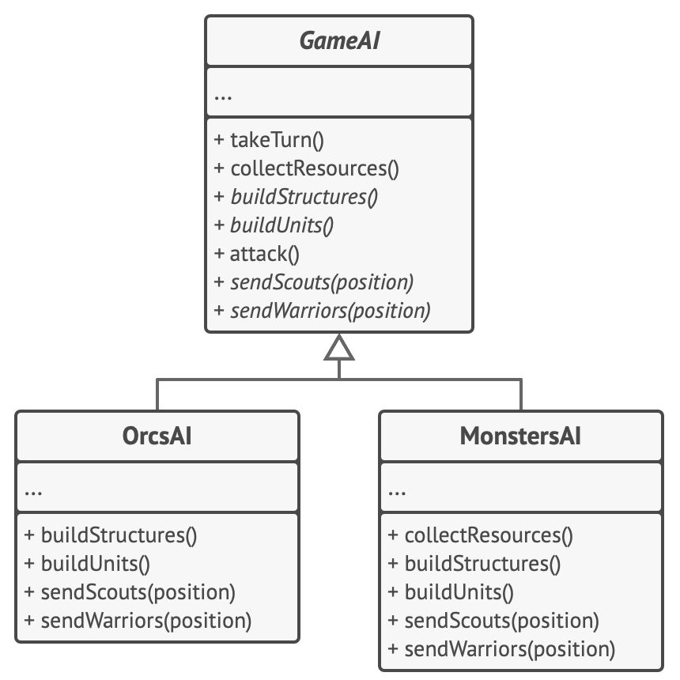
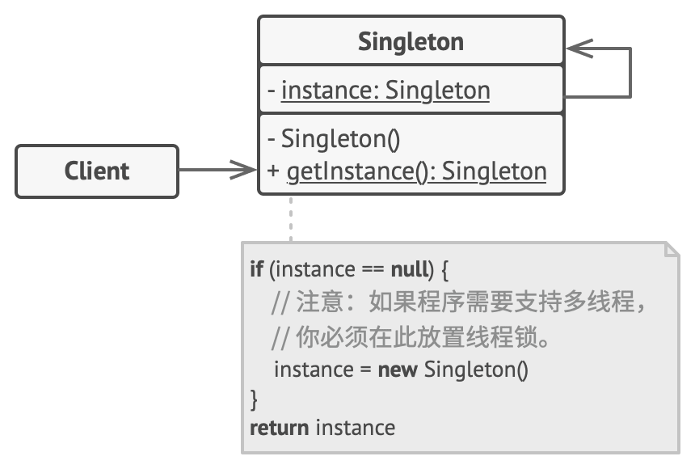

# 设计模式

| 模式名称 | 类别 | 意图 | 模式结构 | 示例 |
|----|----|----|----|----|
| 工厂方法模式 | 创建型模式 | 工厂方法模式是一种创建型设计模式，其在父类中提供一个创建对象的方法，允许子类决定实例化对象的类型。 |  |  |
| 模板方法模式 | 行为型模式 | 模板方法模式是一种行为设计模式，它在超类中定义了一个算法的框架，允许子类在不修改结构的情况下重写算法的特定步骤。 |  |  |

- 工厂方法模式是模板方法模式的一种特殊形式。同时，工厂方法可以作为一个大型模板方法中的一个步骤。

| 模式名称 | 类别 | 意图 | 模式结构 | 示例 |
|----|----|----|----|---|
| 抽象工厂模式 | 创建型模式 | 抽象工厂模式是一种创建型设计模式，它能创建一系列相关的对象，而无需指定其具体类。 |  |  |
| 建造者模式 | 创建型模式 | 建造者模式是一种创建型设计模式，使你能够分步骤创建复杂对象。该模式允许你使用相同的创建代码生成不同类型和形式的对象。 |  |  |
| 原型模式 | 创建型模式 | 原型模式是一种创建型设计模式，使你能够复制已有对象，而又无需使代码依赖它们所属的类。 |  |  |
| 单例模式 | 创建型模式 | 单例模式是一种创建型设计模式，让你能够保证一个类只有一个实例，并提供一个访问该实例的全局节点。 |  | |