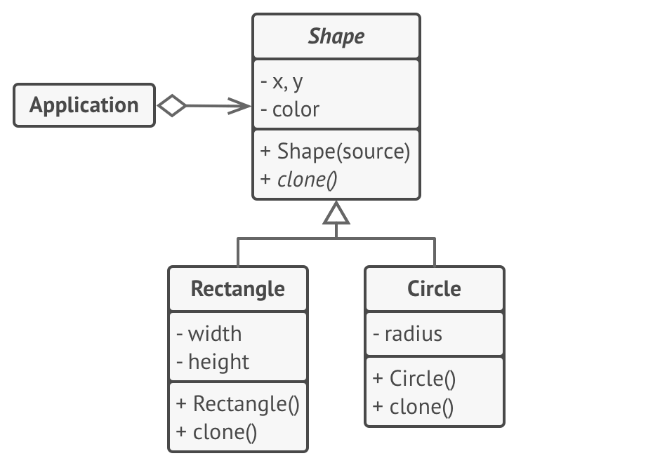

# 设计模式

| 模式名称 | 类别 | 意图 | 模式结构 | 示例 |
|----|----|----|----|----|
| 工厂方法模式 | 创建型模式 | 工厂方法模式是一种创建型设计模式，其在父类中提供一个创建对象的方法，允许子类决定实例化对象的类型。 |  |  |
| 模板方法模式 | 行为型模式 | 模板方法模式是一种行为设计模式，它在超类中定义了一个算法的框架，允许子类在不修改结构的情况下重写算法的特定步骤。 |  |  |

- 工厂方法模式是模板方法模式的一种特殊形式。同时，工厂方法可以作为一个大型模板方法中的一个步骤。

| 模式名称 | 类别 | 意图 | 模式结构 | 示例 |
|----|----|----|----|---|
| 抽象工厂模式 | 创建型模式 | 抽象工厂模式是一种创建型设计模式，它能创建一系列相关的对象，而无需指定其具体类。 |  |  |
| 建造者模式 | 创建型模式 | 建造者模式是一种创建型设计模式，使你能够分步骤创建复杂对象。该模式允许你使用相同的创建代码生成不同类型和形式的对象。 |  |  |
| 原型模式 | 创建型模式 | 原型模式是一种创建型设计模式，使你能够复制已有对象，而又无需使代码依赖它们所属的类。 |  |  |
| 单例模式 | 创建型模式 | 单例模式是一种创建型设计模式，让你能够保证一个类只有一个实例，并提供一个访问该实例的全局节点。 |  | |

| 模式名称 | 类别 | 意图 | 模式结构 | 示例 |
|----|----|----|----|---|
| 装饰模式 | 结构型模式 | 装饰模式是一种结构型设计模式，允许你通过将对象放入包含行为的特殊封装对象中来为原对象绑定新的行为。 |  |  |
| 代理模式 | 结构型模式 | 代理模式是一种结构型设计模式，让你能够提供对象的替代品或其占位符。代理控制着对于原对象的访问， 并允许在将请求提交给对象前后进行一些处理。 |  |  |

- 装饰和代理有着相似的结构，但是其意图却非常不同。这两个模式的构建都基于组合原则，也就是说一个对象应该将部分工作委派给另一个对象。两者之间的不同之处在于代理通常自行管理其服务对象的生命周期，而装饰的生成则总是由客户端进行控制。